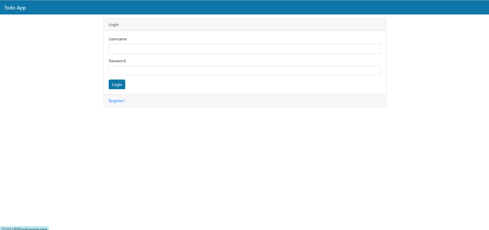
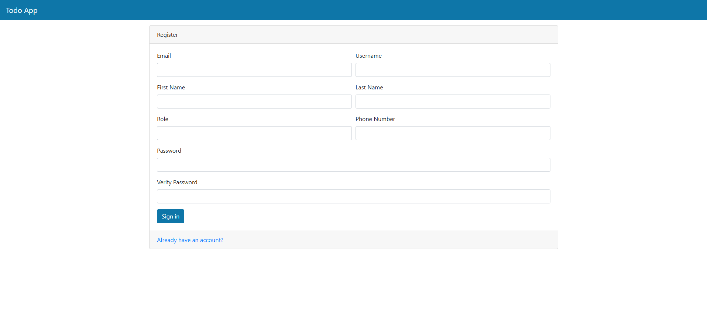
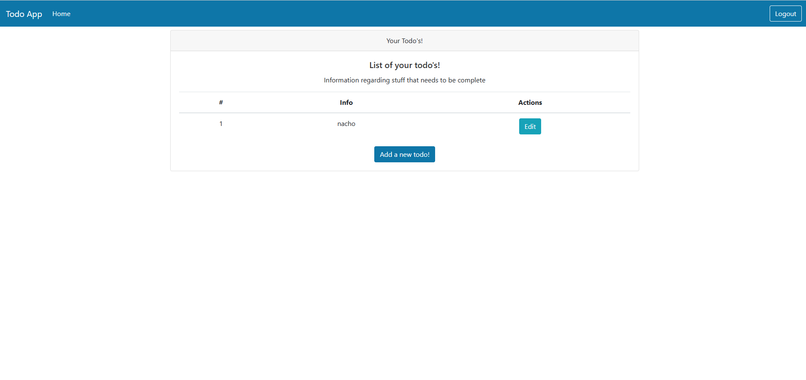
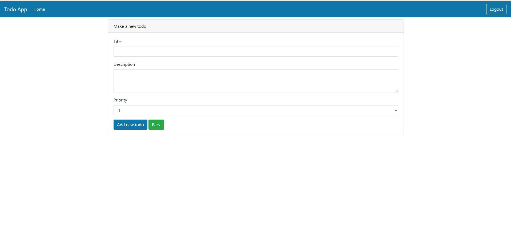

# Project 5 — Todo App with Web UI & Frontend Integration

A full-stack style Todo Management Web Application built with FastAPI, SQLAlchemy, SQLite, JWT Authentication, Jinja2 Templates, Bootstrap, and Pytest.

This project builds upon the backend concepts learned throughout the previous FastAPI projects and introduces a server-rendered Web UI for interacting with the Todo application through a browser.

## 📌 Project Overview

The project extends the Todo Management API from Project 3 by adding a complete web interface.
Instead of interacting with the backend only through Swagger UI or an API client, users can now interact with the application directly through web pages.

The application provides:
* 👤 User registration
* 🔐 User login and authentication
* 🔑 JWT-based authentication
* 📝 Create Todos
* 📋 View Todos
* ✏️ Edit Todos
* 🗑️ Delete/manage Todos
* 🎯 Todo priority management
* 🗄️ SQLAlchemy database integration
* 🔄 Alembic database migrations
* 🧪 Automated testing with Pytest
* 🌐 Server-rendered HTML pages
* 🎨 Bootstrap-based UI
* 📁 Static CSS and JavaScript
* 📖 FastAPI Swagger/OpenAPI documentation

## 🏗️ Application Architecture

The application connects the browser-based frontend with the FastAPI backend, authentication layer, database, and testing infrastructure.

```text
                    ┌──────────────────────┐
                    │      Web Browser     │
                    └───────────┬──────────┘
                                │
                                ▼
                    ┌──────────────────────┐
                    │       FastAPI        │
                    │    Backend Layer     │
                    └───────────┬──────────┘
                                │
             ┌──────────────────┼──────────────────┐
             │                  │                  │
             ▼                  ▼                  ▼
        Authentication      Todo Routes       User Routes
             │                  │                  │
             └──────────────────┼──────────────────┘
                                │
                                ▼
                    ┌──────────────────────┐
                    │     SQLAlchemy       │
                    │         ORM          │
                    └───────────┬──────────┘
                                │
                                ▼
                    ┌──────────────────────┐
                    │      SQLite DB       │
                    └──────────────────────┘
```

## ✨ Features

### 👤 User Authentication
The application provides a complete authentication flow. Users can:
* Register a new account
* Login using their credentials
* Access protected pages
* Logout from the application

Authentication is handled using JWT-based authentication.

### 📝 Todo Management
Authenticated users can manage their own Todo items. Users can:
* Create a Todo
* View existing Todos
* Edit a Todo
* Delete a Todo
* Set Todo priority
* Add Todo descriptions

Each Todo is associated with its owner through the database relationship.

### 🌐 Web User Interface
The project introduces a browser-based interface using:
* HTML
* Jinja2 Templates
* Bootstrap
* CSS
* JavaScript

The UI contains separate pages for authentication and Todo management.

# 🖥️ Application Screenshots

The application provides a simple and user-friendly web interface for authentication and Todo management.

---

## 🔐 Login Page

Users can log in using their registered username and password.



---

## 📝 Registration Page

New users can create an account by providing their personal information and password.



---

## 📋 Todo Dashboard

After successful authentication, users can view and manage their Todo items from the dashboard.



---

## ✏️ Edit Todo

Users can edit an existing Todo and update its title, description, and priority.



## 🔄 Application Flow
```text
              ┌─────────────────┐
              │   Registration  │
              └────────┬────────┘
                       │
                       ▼
              ┌─────────────────┐
              │      Login      │
              └────────┬────────┘
                       │
                       ▼
              ┌─────────────────┐
              │  Todo Dashboard │
              └────────┬────────┘
                       │
              ┌────────┼────────┐
              │        │        │
              ▼        ▼        ▼
            Create    Edit    Delete
              │        │        │
              └────────┼────────┘
                       ▼
                Database Update
```

## 📂 Project Structure
```text
Project 5 - Todo App with Web UI & Frontend Integration/
│
├── Screenshots/
│   ├── 1-login.png
│   ├── 2-register.png
│   ├── 3-todo.png
│   └── 4-edit-todo.png
│
├── alembic/
│   └── ...
│
├── routers/
│   ├── admin.py
│   ├── auth.py
│   ├── todos.py
│   └── users.py
│
├── static/
│   ├── css/
│   │   ├── base.css
│   │   └── bootstrap.css
│   │
│   └── js/
│       ├── base.js
│       ├── bootstrap.js
│       ├── bootstrap.js.map
│       ├── jquery-slim.js
│       ├── popper.js
│       └── popper.min.js.map
│
├── templates/
│   ├── add-todo.html
│   ├── edit-todo.html
│   ├── home.html
│   ├── layout.html
│   ├── login.html
│   ├── navbar.html
│   ├── register.html
│   └── todo.html
│
├── test/
│   ├── ...
│
├── __init__.py
├── alembic.ini
├── database.py
├── main.py
├── models.py
├── testdb.db
└── todosapp.db
```

## 🧩 Main Components

### `main.py`
The main FastAPI application entry point. It is responsible for:
* Creating the FastAPI application
* Registering routers
* Serving static files
* Configuring templates
* Defining application-level routes

### `routers/`
The application logic is separated into multiple routers.
```text
routers/
├── auth.py
├── todos.py
├── users.py
└── admin.py
```
This modular structure keeps authentication, user management, Todo operations, and admin functionality separated.

### `templates/`
The templates directory contains the HTML pages used by the Web UI.
```text
templates/
├── add-todo.html
├── edit-todo.html
├── home.html
├── layout.html
├── login.html
├── navbar.html
├── register.html
└── todo.html
```
Jinja2 templates are used to dynamically render application data.

### `static/`
Static frontend assets are stored inside the static directory.
```text
static/
├── css/
└── js/
```
The project uses CSS, JavaScript, and Bootstrap assets to provide styling and frontend functionality.

## 🔐 Authentication Flow
The authentication process follows this flow:
```text
             User
              │
              ▼
        Registration
              │
              ▼
        Login Request
              │
              ▼
      Verify Credentials
              │
              ▼
          JWT Token
              │
              ▼
       Protected Routes
              │
              ▼
       Todo Application
```
Protected routes require an authenticated user.

## 🗄️ Database
The application uses SQLite as the database and SQLAlchemy as the ORM.
The database stores information related to users and Todos.

```text
User
Users
├── id
├── email
├── username
├── first_name
├── last_name
├── hashed_password
├── is_active
└── role

Todo
Todos
├── id
├── title
├── description
├── priority
├── complete
└── owner_id
```
The `owner_id` field connects each Todo with its respective user.
```text
Users
   │
   │ 1
   │
   │
   │ N
   ▼
Todos
```

## 🔄 Database Migrations
The project includes Alembic for database schema migration management.
Alembic provides a structured workflow for tracking and applying database schema changes.
```text
Model Changes
      │
      ▼
Alembic Revision
      │
      ▼
Migration Script
      │
      ▼
Database Upgrade
      │
      ▼
Updated Schema
```
This builds upon the database migration concepts introduced in Project 3.5.

## 🧪 Testing
The project includes automated tests using Pytest.
Testing covers the backend functionality introduced in the Todo Management API.
The test suite includes areas such as:
* Authentication
* User operations
* Todo operations
* Admin operations
* API routes
* Database interactions
* Protected endpoints

Run the test suite with:
```bash
pytest
```
For detailed output:
```bash
pytest -v
```

## 🛠️ Tech Stack

| Technology | Purpose |
|---|---|
| Python | Programming language |
| FastAPI | Backend web framework |
| SQLAlchemy | ORM and database interaction |
| SQLite | Database |
| Pydantic | Data validation |
| JWT | Authentication |
| OAuth2 | Authentication flow |
| Alembic | Database migrations |
| Jinja2 | Server-side HTML templates |
| HTML | Web interface |
| CSS | Styling |
| Bootstrap | UI components and layout |
| JavaScript | Frontend functionality |
| Pytest | Automated testing |
| Uvicorn | ASGI server |

## 📖 Concepts Covered
* **FastAPI:** FastAPI application structure, Routers, API endpoints, Dependency Injection, Request handling, Response handling
* **Authentication:** User registration, Login, JWT authentication, OAuth2, Password hashing, Protected routes, Role-based authorization
* **Database:** SQLAlchemy ORM, Database sessions, SQLite, Database models, Primary Keys, Foreign Keys, One-to-Many relationships
* **Database Migration:** Alembic, Migration revisions, Database schema evolution, Upgrade and downgrade workflow
* **Frontend Integration:** Jinja2 templates, HTML forms, Template inheritance, Static files, CSS, Bootstrap, JavaScript, Server-side rendering
* **Testing:** Pytest, TestClient, API testing, Authentication testing, CRUD testing, Dependency testing, Integration testing

## ▶️ How to Run

### 1. Create Virtual Environment
```bash
python -m venv fastapienv
```
Windows:
```cmd
fastapienv\Scripts ctivate
```

### 2. Install Dependencies
```bash
pip install -r requirements.txt
```

### 3. Start the Application
From the project directory:
```bash
uvicorn main:app --reload
```

### 4. Open the Web Application
Open the application in your browser:
```text
http://127.0.0.1:8000
```

### 5. Open Swagger UI
FastAPI also provides automatic API documentation:
```text
http://127.0.0.1:8000/docs
```
Swagger UI can be used to test the backend API endpoints directly.

## 🎯 Project Highlights
* 🚀 Built a complete FastAPI-based Todo application
* 🌐 Added a browser-based Web UI
* 🔐 Implemented authentication and authorization
* 👤 Added user registration and login
* 📝 Implemented Todo CRUD functionality
* 🗄️ Integrated SQLAlchemy with SQLite
* 🔄 Added Alembic database migrations
* 🧪 Added automated testing with Pytest
* 🎨 Integrated Bootstrap-based frontend styling
* 📄 Implemented Jinja2 server-side templates
* 📁 Organized frontend and backend components
* 🔗 Connected frontend pages with backend functionality

## 📚 FastAPI Learning Journey
This project is the fifth major project in my FastAPI learning journey.
```text
Project 1
FastAPI Request Method Logic
        │
        ▼
Project 2
FastAPI Book API
Validation & CRUD
        │
        ▼
Project 3
Todo Management API
SQLAlchemy + JWT Authentication
        │
        ▼
Project 3.5
Alembic Database Migration
        │
        ▼
Project 4
Unit & Integration Testing
Pytest + TestClient
        │
        ▼
Project 5
Todo App with Web UI
Frontend Integration
```
Each project builds upon the previous one and gradually introduces more advanced backend development concepts.

## 🧠 Learning Outcome
Project 5 helped me move from building API-only applications toward building a more complete web application.
I gained practical experience connecting:
```text
Frontend
   │
   ▼
Jinja2 Templates
   │
   ▼
FastAPI
   │
   ▼
Authentication
   │
   ▼
SQLAlchemy
   │
   ▼
Database
```
This project strengthened my understanding of how frontend interfaces, backend APIs, authentication, databases, migrations, and testing work together in a real application.
